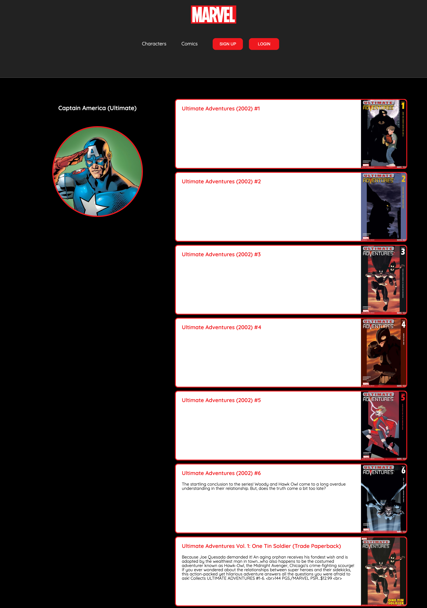
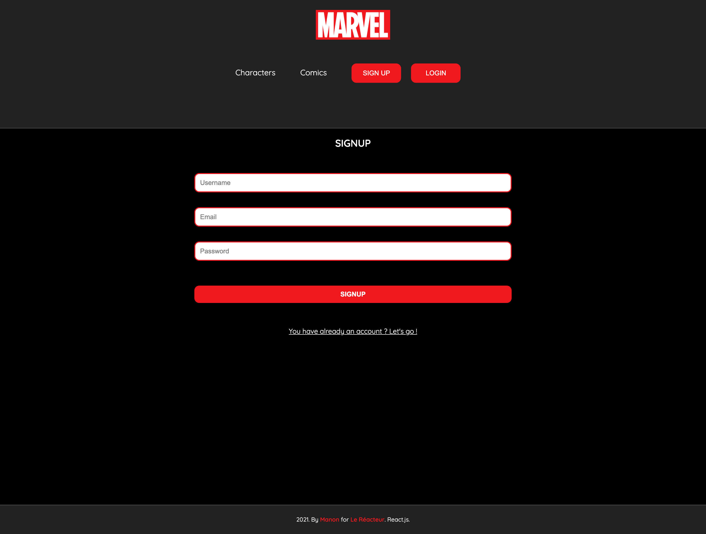
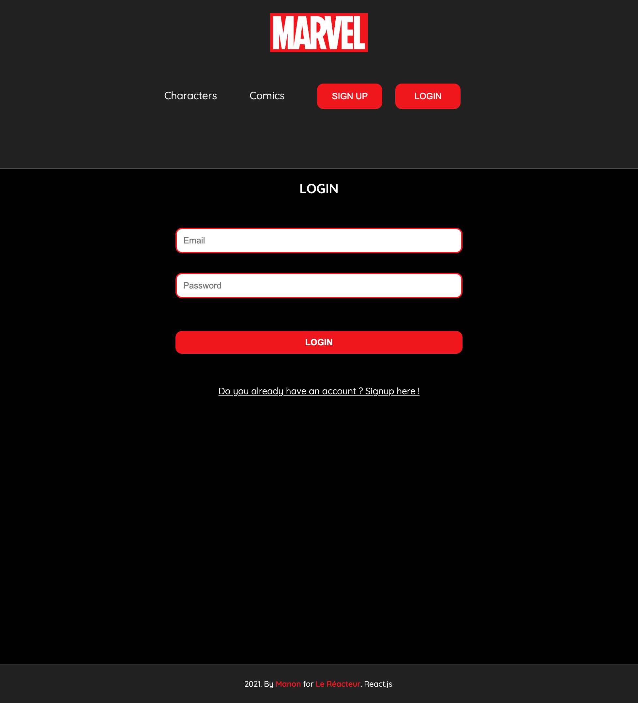

# MARVEL WEB APP 👩🏿‍🎤🥷🏼🦹🏻‍♀️

🌤 May 2021  
⚙️ Backend  
✨ Frontend - check the frontend [repo](https://github.com/manon-boiteau/marvel-front-LeReacteur.git)  
🔗 Netlify - check [that](https://mymarvel-lereacteur-2021.netlify.app/)

## 🌈 Overview - Welcome dude

---

Marvel web app made at [Le Reacteur](https://www.lereacteur.io/) Bootcamp.  
5 screens are availables: home page with all the Marvel's characters, comics page, individual character page, signup and login.

]

## 👩🏻‍💻 Tasks

---

✘ Create a server (Express)  
✘ Create models  
✘ Code signup and login endpoints  
✘ Do HTTP requests to Marvel's API  
✘ Implement a React router

## 📚 Stacks

---

[Javascript](https://www.w3schools.com/js/default.asp)  
[NodeJS](https://nodejs.org/api/documentation.html)  
[Express](https://github.com/expressjs/express)  
[Express Formidable](https://github.com/hatashiro/express-formidable)  
[Mongoose](https://mongoosejs.com/docs/guide.html)  
[Axios](https://github.com/axios/axios)

## 🗝 Installation and usage

---

Be sure, you have installed all dependencies to run the project.

### 🚙 Running the project

1️. Clone this repository

`git clone https://github.com/manon-boiteau/marvel-back-LeReacteur.git`

`cd marvel-back-LeReacteur`

2️. Install packages

`npm install`

3️. When installation is complete:

`node index.js`

🙏🏻 Thank you @LeReacteur.
